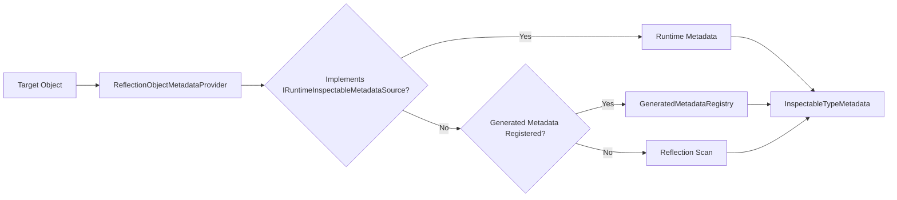
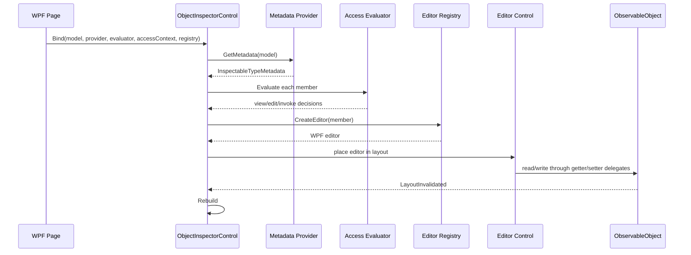
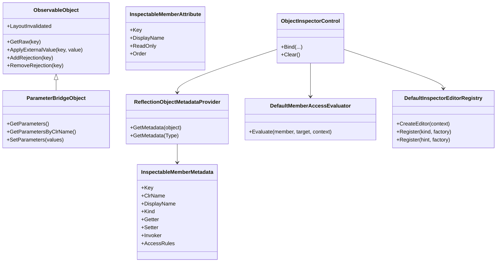
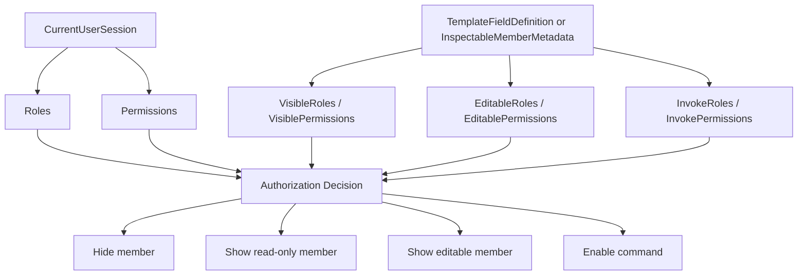
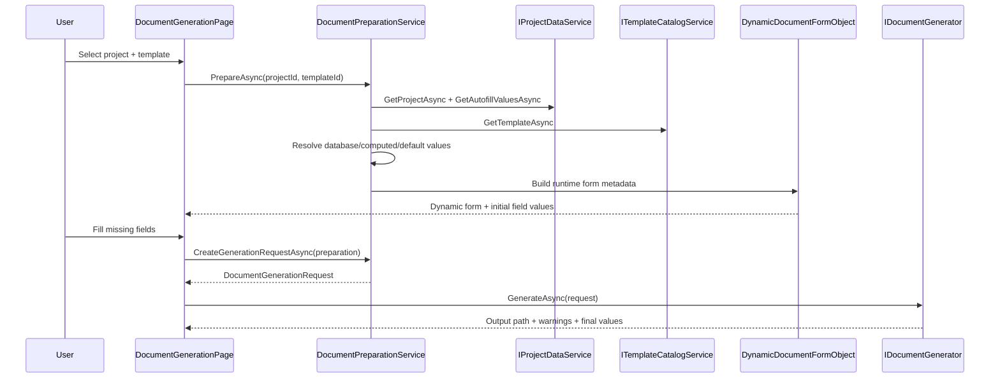
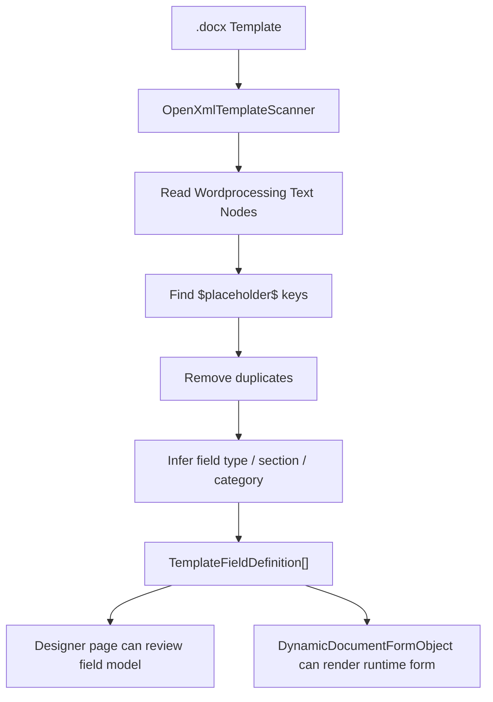
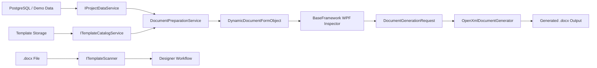
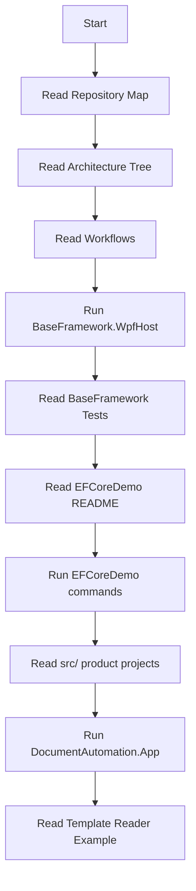

# Diagrams

This file collects Mermaid diagrams for the main architectures and workflows.

You can copy these blocks into GitHub Markdown preview or other Mermaid viewers.

## 1. Repository Architecture Tree

```mermaid
flowchart TB
    Repo["DocumentAutomation Repository"]
    Repo --> BF["BaseFrameWork"]
    Repo --> PG["BaseFrameWorkAndPosgreSQL"]
    Repo --> Docs["docs"]
    Repo --> Product["src + tests"]

    BF --> Core["BaseFramework.Core"]
    BF --> Gen["BaseFramework.Generators"]
    BF --> Wpf["BaseFramework.Wpf"]
    BF --> WpfHost["BaseFramework.WpfHost"]
    BF --> WebHost["BaseFramework.WebHost"]
    BF --> BfTests["Core + WPF Tests"]

    PG --> EF["EFCoreDemo"]
    PG --> Scripts["scripts"]

    Product --> App["DocumentAutomation.App"]
    Product --> Application["DocumentAutomation.Application"]
    Product --> Domain["DocumentAutomation.Domain"]
    Product --> Infra["DocumentAutomation.Infrastructure"]
    Product --> Persistence["DocumentAutomation.Persistence"]
    Product --> Word["DocumentAutomation.Word"]
    Product --> ProductTests["Application / Persistence / Word Tests"]
```

## 2. BaseFramework Metadata Flow

## 3. Dynamic UI Generation Flow

## 4. BaseFramework Core Class Diagram

## 5. Role / Permission Flow

## 6. Document Generation Workflow

## 7. Template Reader Workflow

## 8. Database -> App -> Document Pipeline

## 9. Learning Flow Through The Repository

