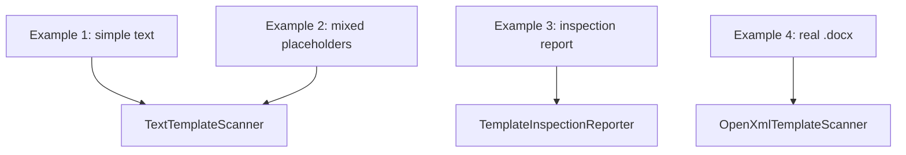

# Document Examples

This file collects the smallest examples for the document subsystem.

## Example 1: Simple Text Placeholders

Source file:

- [example-01-simple-text.txt](C:\Users\ujkar\OneDrive\Desktop\DocumentGenerator\DocumentAutomation\src\DocumentAutomation.Word\Examples\Templates\example-01-simple-text.txt)

Input:

```text
Project Name: $project_name$
Project Code: $project_code$
```

Expected scan result:

- `project_name -> Text`
- `project_code -> Text`

Where to start reading:

- [TemplateReaderExamples.cs](C:\Users\ujkar\OneDrive\Desktop\DocumentGenerator\DocumentAutomation\src\DocumentAutomation.Word\Examples\TemplateReaderExamples.cs)
- [TextTemplateScanner.cs](C:\Users\ujkar\OneDrive\Desktop\DocumentGenerator\DocumentAutomation\src\DocumentAutomation.Word\Parsing\TextTemplateScanner.cs)

## Example 2: Mixed Placeholders

Source file:

- [example-02-mixed-placeholders.txt](C:\Users\ujkar\OneDrive\Desktop\DocumentGenerator\DocumentAutomation\src\DocumentAutomation.Word\Examples\Templates\example-02-mixed-placeholders.txt)

Input:

```text
Project Name: $project_name$
Test Date: $test_date$
Test Setup Image: $image:test_setup$
Test Results Table: $table:test_results$
```

Expected scan result:

- `project_name -> Text`
- `test_date -> Date`
- `image:test_setup -> Image`
- `table:test_results -> Table`

Where to start reading:

- [PlaceholderParser.cs](C:\Users\ujkar\OneDrive\Desktop\DocumentGenerator\DocumentAutomation\src\DocumentAutomation.Word\Parsing\PlaceholderParser.cs)
- [TemplateFieldDefinitionFactory.cs](C:\Users\ujkar\OneDrive\Desktop\DocumentGenerator\DocumentAutomation\src\DocumentAutomation.Word\Parsing\TemplateFieldDefinitionFactory.cs)

## Example 3: Template Inspection Demo

The inspection demo prints a readable report that includes:

- key
- field type
- display label suggestion
- likely source
- required flag

Main code:

- [TemplateInspectionReporter.cs](C:\Users\ujkar\OneDrive\Desktop\DocumentGenerator\DocumentAutomation\src\DocumentAutomation.Word\Examples\TemplateInspectionReporter.cs)

Example output:

```text
Template: example-02-mixed-placeholders
Fields: 4
- Key: project_name
  Type: Text
  Label: Project Name
  Likely Source: Database -> User -> Default
  Required: True
- Key: test_date
  Type: Date
  Label: Test Date
  Likely Source: Database -> User -> Default
  Required: True
- Key: image:test_setup
  Type: Image
  Label: Test Setup
  Likely Source: User
  Required: True
- Key: table:test_results
  Type: Table
  Label: Test Results
  Likely Source: User
  Required: True
```

## Example 4: Real `.docx` Demo Template

The repository also has a real Word example:

- [system-acceptance-report.docx](C:\Users\ujkar\OneDrive\Desktop\DocumentGenerator\DocumentAutomation\src\DocumentAutomation.App\data\templates\system-acceptance-report.docx)

Supporting code:

- [DemoTemplateDocumentWriter.cs](C:\Users\ujkar\OneDrive\Desktop\DocumentGenerator\DocumentAutomation\src\DocumentAutomation.Word\OpenXml\DemoTemplateDocumentWriter.cs)
- [OpenXmlTemplateScanner.cs](C:\Users\ujkar\OneDrive\Desktop\DocumentGenerator\DocumentAutomation\src\DocumentAutomation.Word\OpenXml\OpenXmlTemplateScanner.cs)
- [OpenXmlDocumentGenerator.cs](C:\Users\ujkar\OneDrive\Desktop\DocumentGenerator\DocumentAutomation\src\DocumentAutomation.Word\OpenXml\OpenXmlDocumentGenerator.cs)

## How To Run The Examples

Run the document tests:

```powershell
dotnet test tests\DocumentAutomation.Word.Tests\DocumentAutomation.Word.Tests.csproj
```

Open the product app and inspect the designer page:

```powershell
dotnet run --project src\DocumentAutomation.App\DocumentAutomation.App.csproj
```

## Mermaid: Example Relationships


