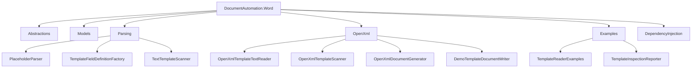

# Document Subsystem Tree

This document explains only the document-template reader and generator foundation.

The goal is simple:

1. read template text
2. find placeholders
3. convert placeholders into structured fields
4. later inject values and render a document

## Subsystem Tree

```text
src/DocumentAutomation.Word/
|- README.md
|- Abstractions/
|  `- ITemplateTextReader.cs
|- Models/
|  `- PlaceholderToken.cs
|- Parsing/
|  |- PlaceholderParser.cs
|  |- TemplateFieldDefinitionFactory.cs
|  `- TextTemplateScanner.cs
|- OpenXml/
|  |- DemoTemplateDocumentWriter.cs
|  |- OpenXmlDocumentGenerator.cs
|  |- OpenXmlTemplateScanner.cs
|  `- OpenXmlTemplateTextReader.cs
|- Examples/
|  |- TemplateInspectionReporter.cs
|  |- TemplateReaderExamples.cs
|  `- Templates/
|     |- example-01-simple-text.txt
|     `- example-02-mixed-placeholders.txt
`- DependencyInjection/
   `- ServiceCollectionExtensions.cs
```

## What Each Part Does

### `Abstractions`

- `ITemplateTextReader`
  - Reads plain text from a template source.
  - This keeps file-format code separate from placeholder rules.

### `Models`

- `PlaceholderToken`
  - Represents one balanced placeholder match.
  - Example: raw text `$project_name$`, key `project_name`.

### `Parsing`

- `PlaceholderParser`
  - Finds balanced `$...$` tokens in text.
  - Ignores malformed fragments such as `$project_name`.
- `TemplateFieldDefinitionFactory`
  - Converts raw tokens into `TemplateFieldDefinition`.
  - Infers field type, display label, DB key, and likely source.
- `TextTemplateScanner`
  - Orchestrates parse + field creation for plain text content.
  - This is the easiest class to start reading.

### `OpenXml`

- `OpenXmlTemplateTextReader`
  - Reads visible text from `.docx`.
  - Does not decide what placeholders mean.
- `OpenXmlTemplateScanner`
  - Uses the OpenXML text reader plus the plain-text scanner.
  - This adapter keeps the OpenXML layer thin.
- `OpenXmlDocumentGenerator`
  - Copies a template and replaces simple text placeholders.
  - Reports unsupported image/table placeholders as warnings.
- `DemoTemplateDocumentWriter`
  - Creates a tiny `.docx` demo template used by tests and demos.

### `Examples`

- `TemplateReaderExamples`
  - Small example templates for learning the parser.
- `TemplateInspectionReporter`
  - Produces a readable text report from scan results.
- `Templates/*.txt`
  - Human-readable sample inputs.

### `DependencyInjection`

- `ServiceCollectionExtensions`
  - Registers parser, scanner, reader, and generator services.

## Class Responsibility Table

| Class | Responsibility | Used By |
| --- | --- | --- |
| `PlaceholderParser` | Finds balanced `$...$` placeholders in plain text. | `TextTemplateScanner`, tests |
| `TemplateFieldDefinitionFactory` | Turns placeholder tokens into shared field definitions. | `TextTemplateScanner`, tests |
| `TextTemplateScanner` | Runs parse + field creation on plain text content. | examples, `OpenXmlTemplateScanner`, tests |
| `OpenXmlTemplateTextReader` | Extracts visible text from a `.docx`. | `OpenXmlTemplateScanner` |
| `OpenXmlTemplateScanner` | Adapts `.docx` files to the plain-text scanner flow. | app designer page, tests |
| `OpenXmlDocumentGenerator` | Replaces supported text placeholders in a copied output document. | app generation flow, tests |
| `TemplateReaderExamples` | Supplies small learning-focused example templates. | docs, tests |
| `TemplateInspectionReporter` | Produces a readable scan report. | docs, tests |

## Shared Domain Types Used By The Subsystem

The Word project does not redefine the app's main document models.
It uses the shared types that already exist in the domain and application layers:

- `TemplateDefinition`
- `TemplateFieldDefinition`
- `TemplateFieldType`
- `DocumentFieldValue`
- `DocumentGenerationRequest`
- `DocumentGenerationResult`
- `TemplateScanResult`

This keeps one set of business types for the whole application.

## Mermaid Tree



## Dependency Summary

- `OpenXmlTemplateScanner` depends on:
  - `ITemplateTextReader`
  - `TextTemplateScanner`
- `TextTemplateScanner` depends on:
  - `PlaceholderParser`
  - `TemplateFieldDefinitionFactory`
- `OpenXmlDocumentGenerator` depends on:
  - shared domain request/result models
  - OpenXML package APIs
