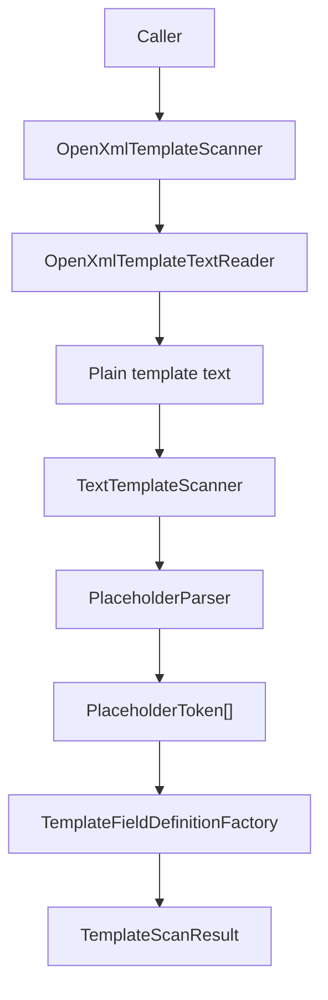
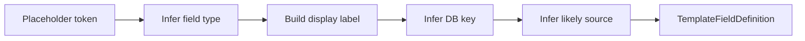
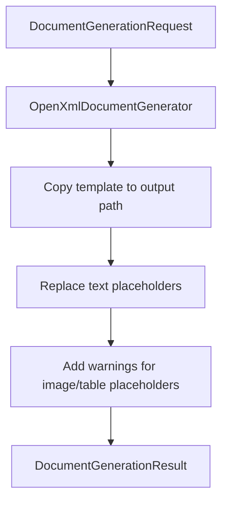
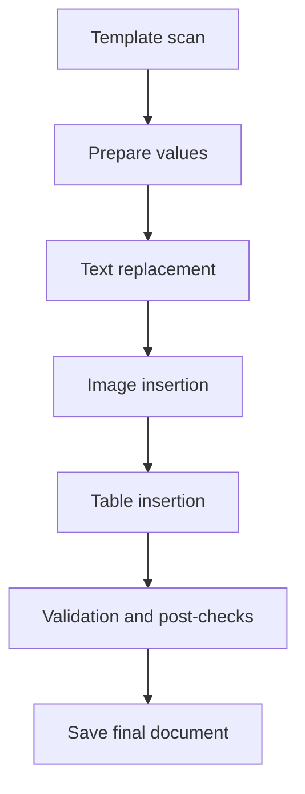

# Document Workflow

This file explains how the document subsystem works today.

The design tries to stay very small:

1. read template text
2. parse placeholders
3. infer field definitions
4. prepare values elsewhere in the app
5. render a document by replacing supported placeholders

## 1. Template Scan Workflow

Step by step:

1. A caller asks `OpenXmlTemplateScanner` to scan a `.docx`.
2. `OpenXmlTemplateTextReader` reads visible text from the main document, headers, and footers.
3. `TextTemplateScanner` receives one plain text string.
4. `PlaceholderParser` finds balanced `$...$` tokens.
5. `TemplateFieldDefinitionFactory` converts tokens into `TemplateFieldDefinition`.
6. Duplicate keys are collapsed into one field definition.
7. The scanner returns `TemplateScanResult`.

### Mermaid: Template Scan Flow

## 2. Field Extraction Workflow

The field factory uses simple rules.

Examples:

- `image:` prefix -> `Image`
- `table:` prefix -> `Table`
- key containing `date` -> `Date`
- key containing `note` -> `Note`
- key containing `summary` or `description` -> `MultiLineText`
- otherwise -> `Text`

The same class also suggests:

- display label
- likely DB key
- likely source priority

### Mermaid: Field Extraction Flow

## 3. Render Workflow

Today the render path is intentionally small.

Step by step:

1. The app builds `DocumentGenerationRequest`.
2. `OpenXmlDocumentGenerator` copies the template file to an output path.
3. It replaces supported text placeholders in body, headers, and footers.
4. Image and table fields are recognized but not inserted yet.
5. The generator returns `DocumentGenerationResult` with warnings.

### Mermaid: Render Workflow

## 4. Future Generation Pipeline

The current generator is honest about what is missing.

Future work can extend the same pipeline:

1. text replacement
2. image insertion
3. table insertion
4. richer template metadata
5. support for placeholders split across multiple OpenXML runs

### Mermaid: Future Pipeline

## 5. Why The Workflow Is Split This Way

- Plain-text placeholder rules are easier to read than OpenXML internals.
- Tests can focus on parser behavior without needing `.docx` files.
- OpenXML becomes an adapter instead of the whole design.
- Future file formats can reuse the same parser and field factory.

## 6. Future Extension Notes

- Better handling of placeholders split across multiple runs in Word.
- Real image and table rendering.
- More field types such as boolean and dropdown selection.
- Stronger template validation rules.
- Template-specific formatting rules.
