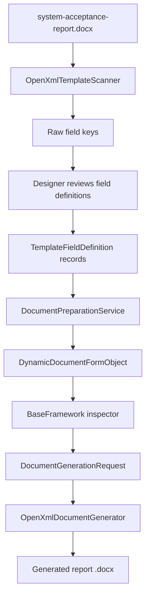

# Template Reader Example

This file gives a concrete example of the future document editor and template reader flow using the current demo template.

## The Example Template

Committed file:

- `src/DocumentAutomation.App/data/templates/system-acceptance-report.docx`

This file is also the same template shape created by:

- `src/DocumentAutomation.Word/OpenXml/DemoTemplateDocumentWriter.cs`

## The Business Scenario

A system engineer wants to generate a "System Acceptance Report".

The report should pull some data from the project record, ask the user for missing data, and then generate a final `.docx`.

## Placeholders Inside The Template

The demo template contains these placeholders:

| Placeholder | Meaning | Likely Type | Likely Source |
| --- | --- | --- | --- |
| `$project_name$` | Name of the project | Text | Database |
| `$project_code$` | Internal project code | Text | Database |
| `$test_date$` | Planned or actual test date | Date | Database |
| `$lead_engineer$` | Lead engineer name | Text | Database |
| `$system.current_user$` | Current app user | Text | Computed |
| `$system.generated_on$` | Generation timestamp | Date | Computed |
| `$summary_note$` | Human-written summary | Multi-line text | User input or default |
| `$image:test_setup$` | Setup photo placeholder | Image | User input |
| `$table:test_results$` | Results table placeholder | Table | User input or future DB shaping |
| `$approval_note$` | Approval / sign-off note | Multi-line text | Restricted user input |

## What The Scanner Does Today

Class:

- `src/DocumentAutomation.Word/OpenXml/OpenXmlTemplateScanner.cs`

The scanner:

1. opens the `.docx`
2. reads text nodes
3. extracts placeholder keys with regex
4. removes duplicates
5. infers a first field type

## Example Scan Result

If the scanner reads the sample template, the field list is conceptually like this:

| Field Key | Display Name | Inferred Type | Required | Section | Category |
| --- | --- | --- | --- | --- | --- |
| `project_name` | Project Name | Text | Yes | Template | Field |
| `project_code` | Project Code | Text | Yes | Template | Field |
| `test_date` | Test Date | Date | Yes | Template | Field |
| `lead_engineer` | Lead Engineer | Text | Yes | Template | Field |
| `system.current_user` | System.Current User | Text | Yes | Template | Field |
| `system.generated_on` | System.Generated On | Date | Yes | Template | Field |
| `summary_note` | Summary Note | Text | Yes | Template | Field |
| `image:test_setup` | Test Setup | Image | Yes | Evidence | Placeholder |
| `table:test_results` | Test Results | Table | Yes | Evidence | Placeholder |
| `approval_note` | Approval Note | Text | Yes | Template | Field |

## Example Of The Product Seeded Definition

The product seed is more detailed than the raw scan.

It adds business meaning such as:

- save-back rules
- permissions
- sections and categories
- source priority
- display names

For example:

| Field Key | Product Type | Display Name | Source Priority | Save Back | Restricted |
| --- | --- | --- | --- | --- | --- |
| `project_name` | Text | Project Name | Database, Default | No | No |
| `project_code` | Text | Project Code | Database, Default | No | No |
| `test_date` | Date | Test Date | Database, Default | No | No |
| `lead_engineer` | Text | Lead Engineer | Database, Default | No | No |
| `system.current_user` | Text | Prepared By | Computed | No | No |
| `system.generated_on` | Date | Generated On | Computed | No | No |
| `summary_note` | MultiLineText | Summary Note | Database, Default | Yes | No |
| `image:test_setup` | Image | Test Setup Image | Database, Default | No | No |
| `table:test_results` | Table | Test Results Table | Database, Default | No | No |
| `approval_note` | MultiLineText | Approval Note | Database, Default | Yes | Yes |

## Example Of The Product Field Object

This is the kind of object the app wants to work with after scanning and review:

```csharp
new TemplateFieldDefinition
{
    FieldKey = "project_name",
    DisplayName = "Project Name",
    FieldType = TemplateFieldType.Text,
    IsRequired = true,
    DatabaseKey = "project.name",
    Section = "Project",
    Category = "Identity",
    SourcePriority = ["Database", "Default"]
};
```

And a restricted field:

```csharp
new TemplateFieldDefinition
{
    FieldKey = "approval_note",
    DisplayName = "Approval Note",
    FieldType = TemplateFieldType.MultiLineText,
    IsRequired = true,
    Section = "Report",
    Category = "Approval",
    AllowSaveBackToProject = true,
    EditablePermissions = [PermissionNames.FieldsEditRestricted]
};
```

## How This Template Moves Through The App

### 1. Template storage

The file lives under:

- `src/DocumentAutomation.App/data/templates`

### 2. Template catalog

The app knows about a `TemplateDefinition` record that points to:

- `system-acceptance-report.docx`

### 3. Scanner

The designer page can rescan the file and rediscover field keys.

### 4. Preparation

The generation page loads:

- the project
- the template
- the current user

Then it resolves values in priority order.

### 5. Runtime form

`DynamicDocumentFormObject` converts those template fields into runtime metadata so the BaseFramework inspector can render them.

### 6. Generation

`OpenXmlDocumentGenerator` copies the template and replaces text placeholders.

Current supported generation:

- text placeholders
- date placeholders rendered as text

Current not-yet-implemented generation:

- image insertion
- table insertion

Those unsupported kinds return warnings instead of silently pretending they worked.

## Example Of Source Decisions

For this template, a realistic first-pass source map is:

| Field Key | Best Source | Why |
| --- | --- | --- |
| `project_name` | Database | Already stored on project |
| `project_code` | Database | Already stored on project |
| `test_date` | Database | Usually scheduled with project |
| `lead_engineer` | Database | Usually assigned to project |
| `system.current_user` | Computed | Comes from current session |
| `system.generated_on` | Computed | Comes from runtime timestamp |
| `summary_note` | User input | Usually specific to this report |
| `image:test_setup` | User input | Usually chosen file |
| `table:test_results` | User input or computed table builder | Needs structured data |
| `approval_note` | Restricted user input | Approval is sensitive |

## What A Future Designer Screen Should Add

Scanning alone is not enough.

A future designer/editor screen should let the designer confirm:

- the friendly display name
- the final field type
- whether the field is required
- the DB key
- the persistence key
- whether save-back is allowed
- visible/editable roles and permissions
- value lists for enum/dropdown fields

## Mermaid Workflow



## Best Files To Read With This Example

1. `src/DocumentAutomation.Word/OpenXml/DemoTemplateDocumentWriter.cs`
2. `src/DocumentAutomation.Word/OpenXml/OpenXmlTemplateScanner.cs`
3. `src/DocumentAutomation.Persistence/Seed/DocumentAutomationSeedData.cs`
4. `src/DocumentAutomation.Application/Services/DocumentPreparationService.cs`
5. `src/DocumentAutomation.Application/DynamicForms/DynamicDocumentFormObject.cs`
6. `src/DocumentAutomation.App/Views/DesignerPage.xaml.cs`
7. `src/DocumentAutomation.App/Views/DocumentGenerationPage.xaml.cs`
8. `tests/DocumentAutomation.Word.Tests/OpenXmlWorkflowTests.cs`
